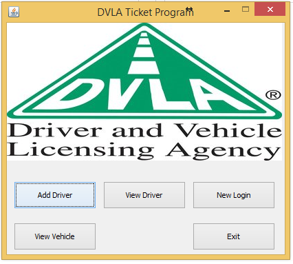
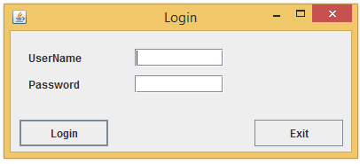

# Speed Ticket Program

The speed ticket program was the first big programming assignment I did during my first year of university.

The program was a simple crud application which allowed users to enter a drivers speeds and have it issue a fine.
The application would save these details to a text file which acted as the database for the program. 

This program was writen in Java, using the spring library for the GUI.

The assignments main focus was to test our understanding of OOP concepts, GUI design improve our experience with programming at the time. 

## Main menu
 

## Login Screen
  

## View project
[See the SpeedTickProgram project on github!](https://github.com/AlexMarriott/SpeedTickProgram)
